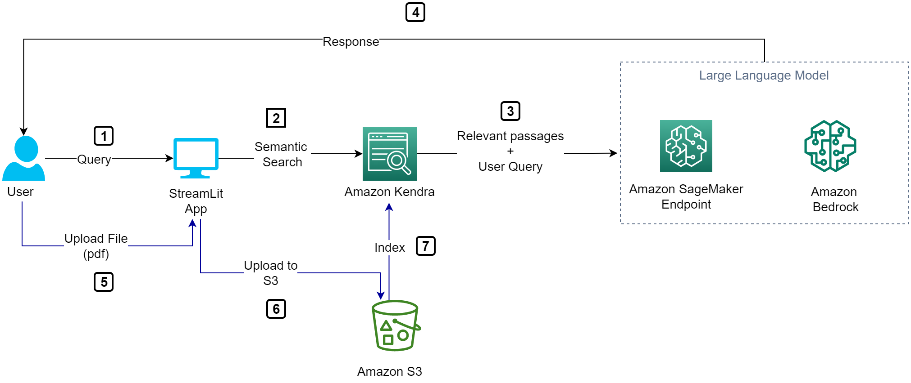
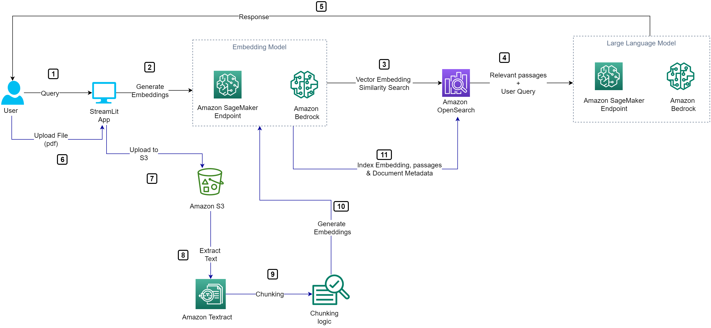
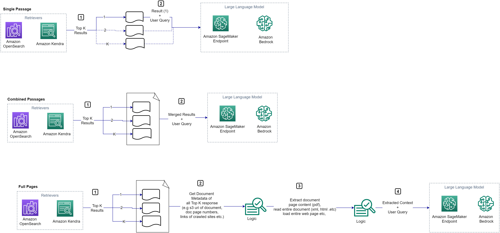
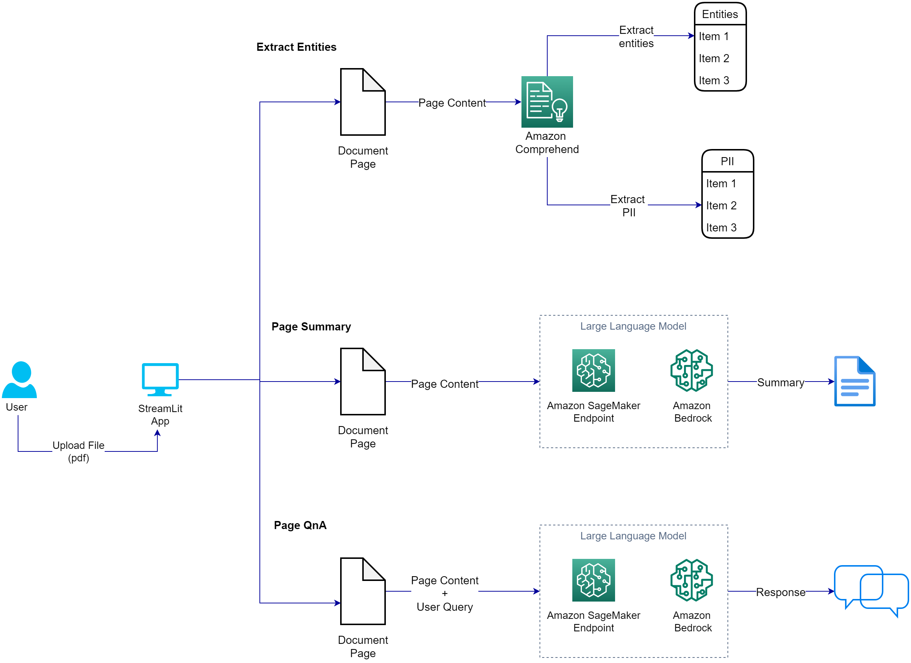
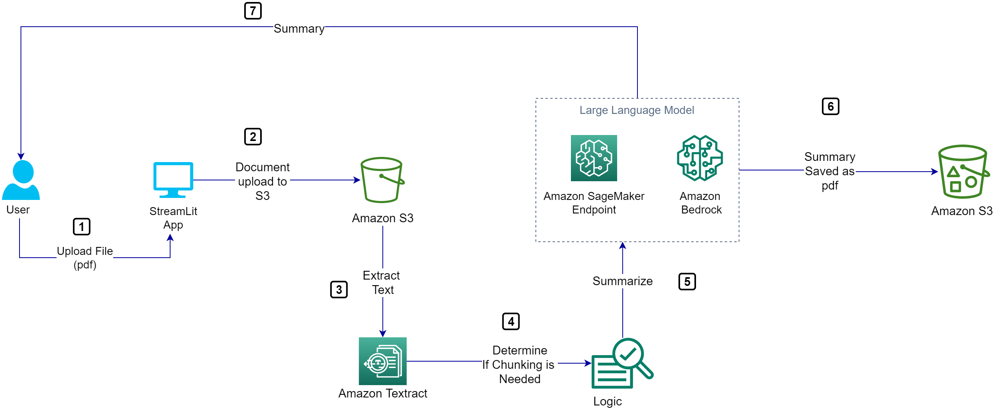
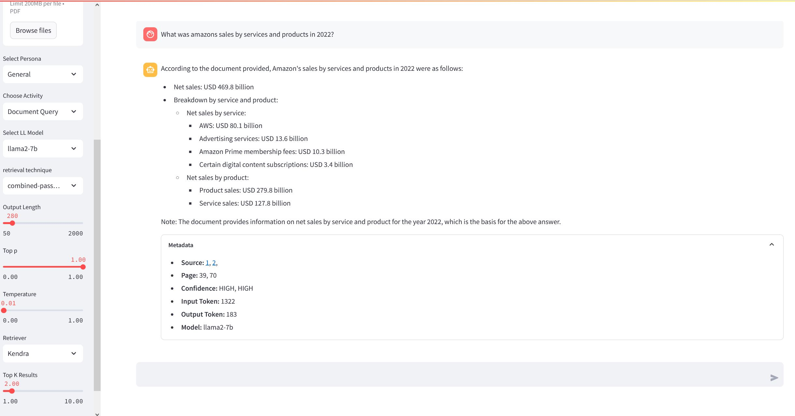
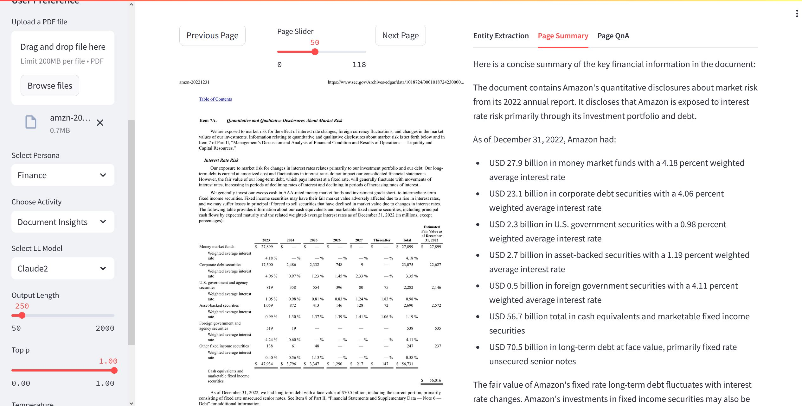
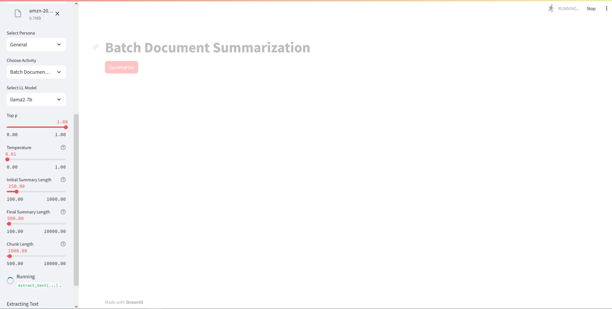

## LLM-App

This project walks you through how yoou can deploy a ChatBot that uses the Retrieval Augmented Generation (RAG) Technique. This ChatBot is Powered by [Amazon Bedrock](https://aws.amazon.com/bedrock/)/[Amazon SageMaker JumStart](https://aws.amazon.com/sagemaker/jumpstart/) LLM/Embedding Models and uses [Amazon Kendra](https://aws.amazon.com/kendra/) and/or [Amazon OpenSearch](https://aws.amazon.com/opensearch-service/) as Vector Storage and Retrieval Engines.

## Git Contents
```
-Images
-Prompt_Template 
    |------- Rag (Contains prompt template for Retrieval Augmented Generation (RAG))
    |------- Summary (Contains prompt template for Summarization)
- application_metadata_complete.json (app configuration file)
- rag-advanced.py (streamlit app)
- requirements.txt
- StreamlitLink.ipynb
```

## PreRequisite
You would need to set up the following before succesfully using this app:
1. [Create Kendra Index](https://docs.aws.amazon.com/kendra/latest/dg/create-index.html)
2. [Create OpenSearch Domain](https://docs.aws.amazon.com/opensearch-service/latest/developerguide/configuration-samples.html) 
3. [Create Amazon Secrets to store OpenSearch Credentials](https://docs.aws.amazon.com/secretsmanager/latest/userguide/create_secret.html). Secrets should be stored as a key/pair value like {"username":`opensearch_username`,"password":`opensearch_password`}.
3. [Deploy LLama2 Models on Amazon SageMaker](https://www.philschmid.de/sagemaker-llama-llm) (Optional)
4. [Deploy HuggingFace Models with Amazon SageMaker JumpStart](https://www.philschmid.de/sagemaker-llama-llm) (Optional)
5. Amazon Bedrock Access.
6. Deploy HuggingFace Embedding Models with SageMaker JumpStart (Optional)
7. Modify the application_metadata_complete.json file with the correct values of your AWS account:
    - llama2-7b value of sagemaker endpoint name **
    - llama2-70b value of sagemaker endpoint name **
    - embedding model values of sagemaker endpoint name (other than cohere and titan keys) **
    - HuggingFace api token for hugginfacekey value **
    - Kendra bucket and prefix values where uploaded file would be stored in Amazon S3
    - Kendra execution role value
    - Kendra index value 
    - Kendra S3 data source name
    - Amazon OpenSearch parameters (domain endpoint, username, password and domain name prefix for created domains)
    - Digital certificate path (tls_cert_path)**
    - Amazon Secrets name for Amazon OpenSearch credentials
    
    ** Optional 
    
   
## Set Up StreamLit Front-End
The streamlit app for this prioject is located in *rag_advanced.py*.

To run this Streamlit App on Sagemaker Studio follow the steps in the link below:
* [Set Up SageMaker Studio](https://docs.aws.amazon.com/sagemaker/latest/dg/onboard-quick-start.html)
* SageMaker execution role should have access to interact with [SageMaker Runtime](https://docs.aws.amazon.com/sagemaker/latest/dg/sagemaker-roles.html), [Bedrock](https://docs.aws.amazon.com/bedrock/latest/userguide/api-setup.html), [OpenSearch](https://docs.aws.amazon.com/opensearch-service/latest/developerguide/fgac-http-auth.html), [ComprehendReadOnly Access](https://docs.aws.amazon.com/comprehend/latest/dg/security-iam-awsmanpol.html) , [Textract](https://docs.aws.amazon.com/aws-managed-policy/latest/reference/AmazonTextractFullAccess.html), [Kendra](https://docs.aws.amazon.com/kendra/latest/dg/security-iam-awsmanpol.html) and [S3](https://docs.aws.amazon.com/AmazonS3/latest/userguide/access-policy-language-overview.html).
* [Launch SageMaker Studio](https://docs.aws.amazon.com/sagemaker/latest/dg/studio-launch.html)
* [Clone this git repo into studio](https://docs.aws.amazon.com/sagemaker/latest/dg/studio-tasks-git.html)
* Open a system terminal by clicking on **Amazon SageMaker Studio** and then **System Terminal** as shown in the diagram below
* 
* Navigate into the cloned repository directory using the `cd` command and run the command `pip install -r requirements.txt` to install the needed python libraries
* Run command `python3 -m streamlit run rag_advanced.py --server.fileWatcherType poll` to start the Streamlit server. Do not use the links generated by the command as they won't work in studio.
* To enter the Streamlit app, open and run the cell in the **StreamlitLink.ipynb** notebook. This will generate the appropiate link to enter your Streamlit app from SageMaker studio. Click on the link to enter your Streamlit app.
* **⚠ Note:**  If you rerun the Streamlit server it may use a different port. Take not of the port used (port number is the last 4 digit number after the last : (colon)) and modify the `port` variable in the `StreamlitLink.ipynb` notebook to get the correct link.

To run this Streamlit App on AWS EC2 (I tested this on the Ubuntu Image)
* [Create a new ec2 instance](https://docs.aws.amazon.com/AWSEC2/latest/UserGuide/EC2_GetStarted.html)
* Expose TCP port range 8500-8510 on Inbound connections of the attached Security group to the ec2 instance. TCP port 8501 is needed for Streamlit to work. See image below
* 
* [Connect to your ec2 instance](https://docs.aws.amazon.com/AWSEC2/latest/UserGuide/AccessingInstances.html)
* Run the appropiate commands to update the ec2 instance (`sudo apt update` and `sudo apt upgrade` -for Ubuntu)
* Clone this git repo `git clone [github_link]`
* Install python3 and pip if not already installed
* EC2 [instance profile role](https://docs.aws.amazon.com/IAM/latest/UserGuide/id_roles_use_switch-role-ec2_instance-profiles.html) has the required permissions to access the services used by this application mentioned above.
* Install the dependencies in the requirements.txt file by running the command `sudo pip install -r requirements.txt`
* Run command `python3 -m streamlit run rag_advanced.py` 
* Copy the external link and paste in a new browser tab

## Application Tools
This application has three tools:
- **DocumentQuery**: This uses the Retrieval Augmented Generation (RAG) apparoach with different retrievers (OpenSearch and Kendra) and lets you select different configurations. The user can upload a pdf and get it indexed in either OpenSearch or Kendra.

    When using Kendra as retriever for relevant passages:
    
    
    1. User makes a query with the frontend StreamLit app.
    2. Kendra searches for relevant passages to the user query against its index available data sources.  
    3. The relevant passage is sent together with the user query as a prompt template to the Large Language Model (LLM).
    4. The LLM provides a response to the user query based off the passage provided as context.
    5. The user can upload a document through the app to be indexed in Kendra.
    6. The document is uploaded to S3.
    7. kendra crawls and indexes the document.
    
    When using opensearch as retriever for relevant passages:
    
    
    1. User makes a query with the frontend StreamLit app.
    2. An embedding model in Bedrock or SageMaker Endpoint generates embeddings of the query.
    3. OpenSearch search algorithm does a similarity search for relevant passages.
    4. The relevant passage is sent together with the user query as a prompt template to the Large Language Model (LLM).
    5. The LLM provides a response to the user query based off the passage provided as context.
    6. The user can upload a document through the app to be indexed in OpenSearch.
    7. The document is uploaded to S3.
    8. Textract extracts the document text.
    9. Document is split into multiple chunks based on users settings.
    10. Embeddings are generated for each chunk.
    11. Chunk embedding is indexed into OpenSearch with the following metadata (page number, chuck passage and document name).
    
    In the RAG approach, your Retrival system is a focal point and determines the relevance/accuracy of the response from the LLM. To improve the retrieval of relevant and sufficent passages, I discuss three different retrieval techniques used in the application:
    
    
    
    1. Single Passages
    
        Here the a single response from the Retrieval system is sent as context to the LLM. The LLM uses the context to answer the user query. However, if the single passage is insufficient or irrelevant, the LLM would respond with a unsatisfactory response. This is a common issues with the RAG approach where the top response from the retrieval system is unsuitable for a robust/accurate answer.
    
    2. Combined Passages
        Here top K responses from the retrieval system is merged together and provided as a single context together with the user query to the LLM. Here the LLM has more context to answer the user query. However, there would be irrelevant passages in the context and its up to the robustness of the LLm to figure the relevant passages in the context and provide the correct answer. This approach also increase the number of input tokens compared to the single approach which in turn will increase cost and potentially latency. Eventually, this comes down to balancing accuracy, latency and the cost pillars of Generative AI applications. However, even with this approach the LLM may not have the sufficient context to answer the question. Especially if its a question that needs to provide a long list of items. This is also directly related to the chunking size used for indexing that OpenSearch vector database (Kendra does not give the option of chunking). If chunking size was large, a page or so, this may be enough context. However, in practice chunking size is usually small (~300 words) so multiple results combined may still not have sufficient context.
    
    3. Full-Pages  
        This tecnique depends on your OpenSearch indexing process (Kendra provides metadata for all its responses). Here the retrival is used to get relevant passages. However, a logic is used to extract the metadata of this passages. This metadata could be s3 location of document (for document store in s3), page number of documents, eg. pdf documents, url links of sites etc. Taking a pdf file as an example, this approach takes the file s3 uri path and the page number of the pdf where the passage was gotten from. The pdf document is read into memeory from s3 and the passage page is extracted and sent to Textract to get the page text content. If topK is greater than 1, each page context are combined to a single docuemnt and then sent to the LLM together with the user query. This same approach aaplies to json, xml, csv, site links (instead of s3, a python api is used to load the site in memory) etc for all top k selected response from the retireval. This techniques offers most context to the LLM and defers to the LLM to figure out the answer from the context. This technique would increase the input token size greatly and would be more costly and latency prone than the two previous technique. However, tends to provide more accurate responses from the LLM as they have more than enough context to answer the questions.   
    
   
- **Document Insights**: This is a more interactive appraoch where the user uploads a document and can interact with each page of that documnet in real time. Things like QnA, Summarization etc. Here the entire rendered page is passed as context to the LLM. No retrival is used in this approach, the user can only interact with a page at a time.



- **Batch Document Summary**: This is an activity for Batch document summarization. The user uploads a pdf document and is able to generate a wholesome summary of the entire document. The docuemnt is upload to s3 and Textract is called to extract the document text. A logic is used to determine if chunking is needed based on the selected LLM context token length using the LLM's tokenizer. If chunking is needed a map-reduce summary is done (summary of summary) else, a single summary is sone on the entire docuemnt. The summary is then saved as a pdf file in s3. 



## UI Feel

**DocumentQuery**

**Document Insights**

**Batch Document Summary** 



## Note
Only Pdf documents are supported for upload at this time using this app.

## Security

See [CONTRIBUTING](CONTRIBUTING.md#security-issue-notifications) for more information.

## License

This library is licensed under the MIT-0 License. See the LICENSE file.

